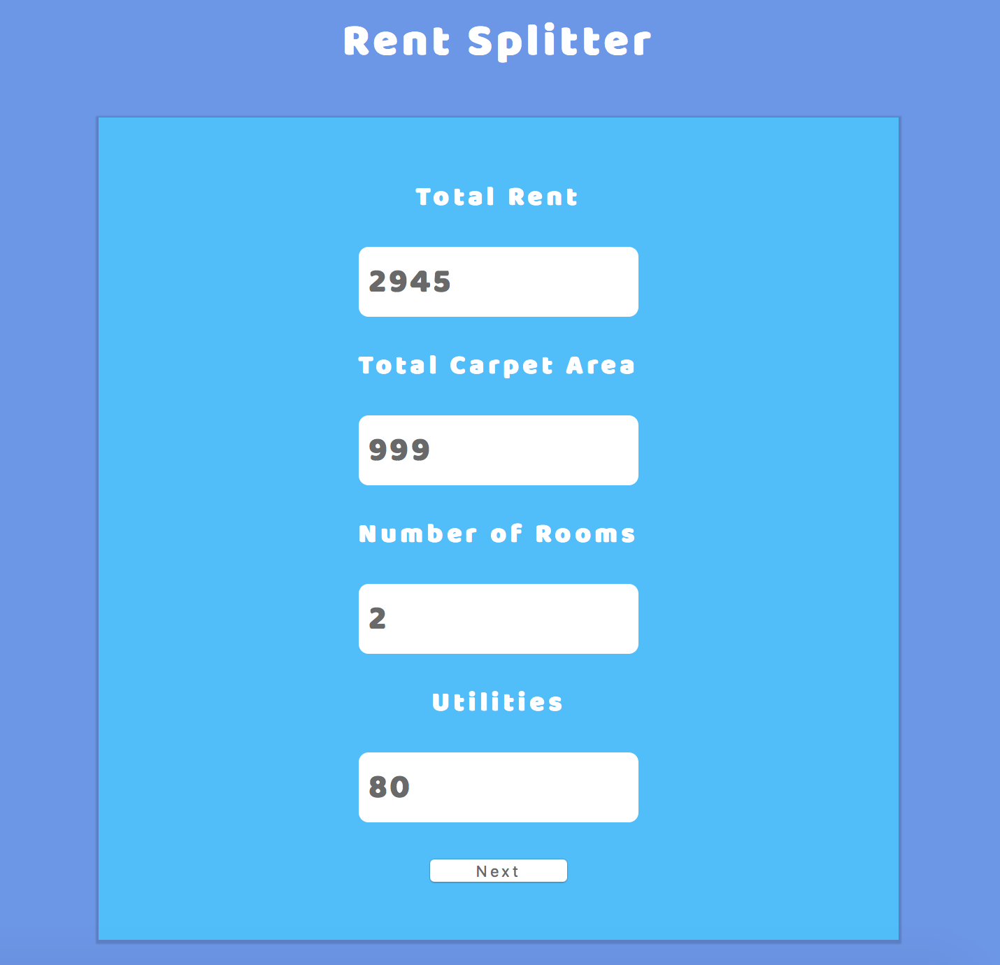
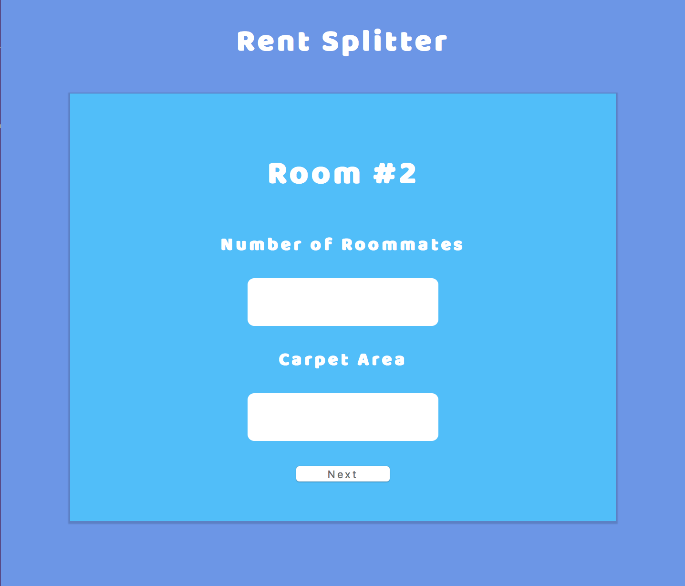
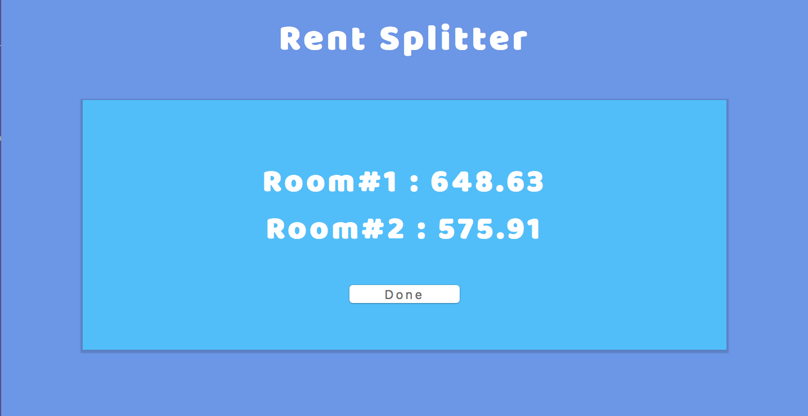

<h1 align="center"> Rent-Splitter Web </h1>

>The purpose of this website is to help college students split their house rent quickly.

## Let's look at some Screenshots . . .

    <ul>
        <li> First enter the basic details of your house.    </li>
        
           >Then each room's details.   
        
           >The website's brain takes cares of the information to calculate your rent.   
        
    </ul>

